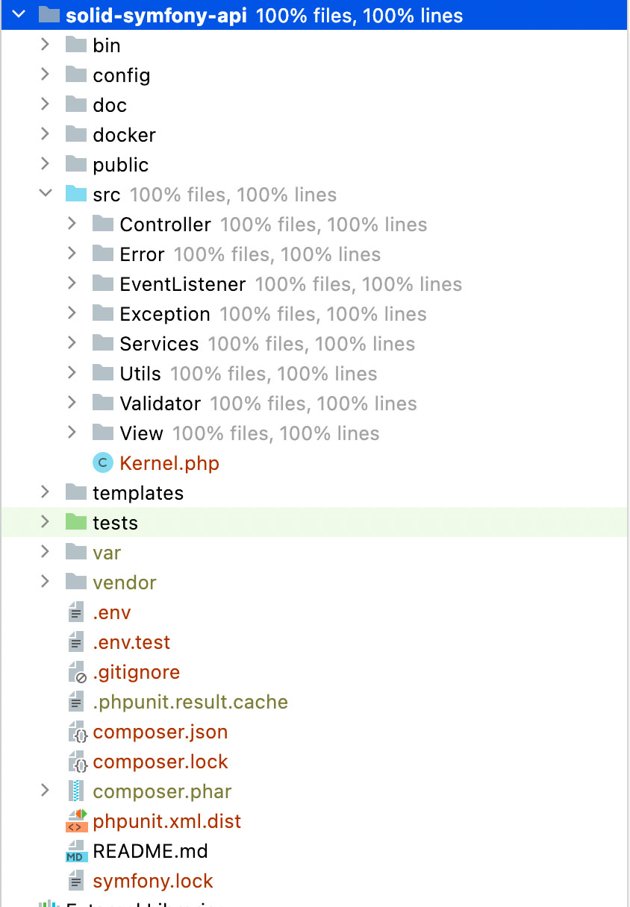

# SOLID-Symfony-API

This repository is an example of how to build REST interfaces with Symfony.
The programming principle SOLID was especially taken into account. 

Design patterns and Dependency Injection can also be found in this repository. 
Since this project focuses on the software architecture, no authentication like JWT (Json Web Token) 
has been implemented.

__This API contains two endpoints.__

- /api/v1/text/analysis
- /api/v1/analyze/url

This project is based on __Symfony 6.1__ with __PHP 8.1__. All code was tested with unit and functional tests 
and has a code coverage of 100%. The code is formatted with __PSR-12__.

### Selection of used packages

__Required to build the project__

- "nelmio/api-doc-bundle": "^4.9" - Swagger documentation
- "jms/serializer-bundle": "^4.0" - Serialize and deserialize JSON
- "phpunit/phpunit": "^9.5" - For testing

__Used for the service endpoints__

- "ezyang/htmlpurifier": "^4.14" - Clean up HTML
- "eightpoints/guzzle-bundle": "^8.3" - Receive external HTML
- "davechild/textstatistics": "^1.0" - Text analysis
- "landrok/language-detector": "^1.3" - Language detection

## Table of contents

- [Installation](doc/Installation.md)
- [Software Architecture](doc/SoftwareArchitecture.md)
- [SOLID](doc/SOLID.md)

If you have any improvements or comments about this project, please let me know.

_But don't forget this project is not intended for productive use, but to illustrate the software architecture._

Cheers,

Stefan H.G. Buchhofer

[https://www.ilenvo.com](https://www.ilenvo.com)
