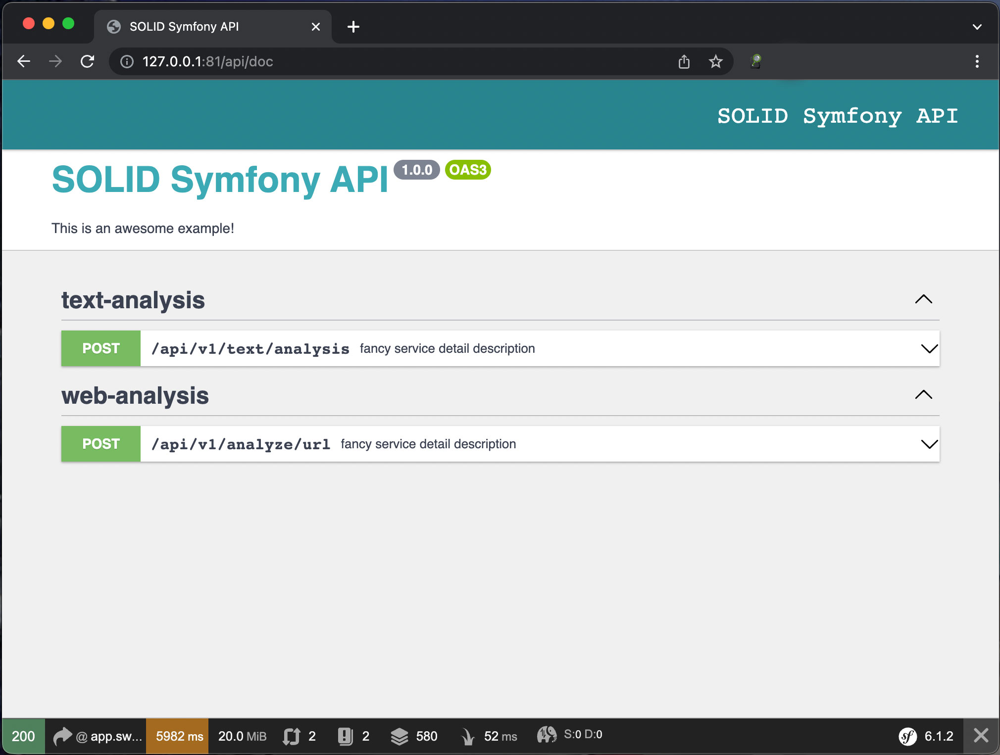

# Installation

[Back to overview](../README.md)

## Checkout the repository

    git clone https://github.com/ilenvo/solid-symfony-api.git

## Start docker container

    cd docker
    docker-compose up

## Composer install

Open a new terminal and go to the docker folder again

    docker-compose exec php-fpm composer install

## Start application

Open your browser and visit http://localhost:81

## Notes

Of course you can also use and configure your local webserver.

[Back to overview](../README.md)
