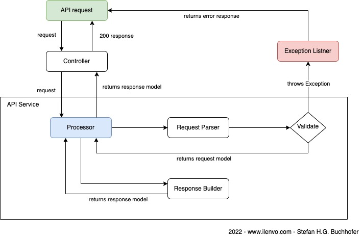

# Software Architecture

[Back to overview](../README.md)

## Folder structure and common files

This projekt uses the symfony default structure. I will only explain the customized structure here!

    Controller
        Api
            Version1 (1)
                ...
    Error (2)
        ...
    EventListener
        ExceptionListener.php (3)
        PerformanceListener.php (4)
        ResponseListener.php (5)
    Exception
        ExceptionInterface.php (6)
        ...
    Services (7)
        TextAnalysis
            Analyze
                Version1 (8)
                    Request
                        ...
                    Response
                        ...
                    Processor.php
        ...
    Utils (9)
        ...
    Validator
        Properties (10)
            ...
        RequestValidator.php (11)
    View
        ApiResponseInterface.php (12)
        ApiResponseProcessor.php (13)
        ...

- (1) This folder holds all REST services which are available in v1
- (2) Error model for error response
- (3) EventListener to build error responses (kernel.exception)
- (4) PerformanceListener measures the processing time  (kernel.request)
- (5) ResponseListener adds custom headers to the REST API response  (kernel.response)
- (6) ExceptionInterface interface for custom API exceptions (validations, guzzle ...)
- (7) This folder holds all the API services
- (8) The structure here is different from the controller folder, this is on purpose! It is easier to see how 
many versions are available of a service.
- (9) Hold some required tools and other stuff
- (10) Folder for custom symfony constraints
- (11) Custom request validator which collects violations and throws a custom exception
- (12) Interface which is implemented by response models, it is required to automatically build a JsonResponse
- (13) Service which is able to build a JsonResponse

## Handling the API REST requests and responses

Overview of handling an API REST request

### Description how an API request is handled

The Symfony router calls the controller with the request

    public function __invoke(Request $request): JsonResponse
    {
        return $this->apiResponseProcessor->createJsonResponse($this->processor->process($request));
    }

The Processor receives the request

    public function process(SymfonyRequest $request): Response
    {
        $requestModel = $this->requestParser->parse($request);
        // if you want to save some data to database or search in db you can do it here

        return $this->responseBuilder->buildResponse($requestModel);
    }

The processor first builds and validates a request model (requestParser)

    $requestModel = $this->requestParser->parse($request);

_Notes: you can also work with data transfer objects (DTOs) and pass them to the responseBuilder_

Next the processor calls the responseBuilder and returns the response

    return $this->responseBuilder->buildResponse($requestModel);

Now the apiResponseProcessor builds a json response

    return $this->apiResponseProcessor->createJsonResponse($this->processor->process($request));

[Back to overview](../README.md)
